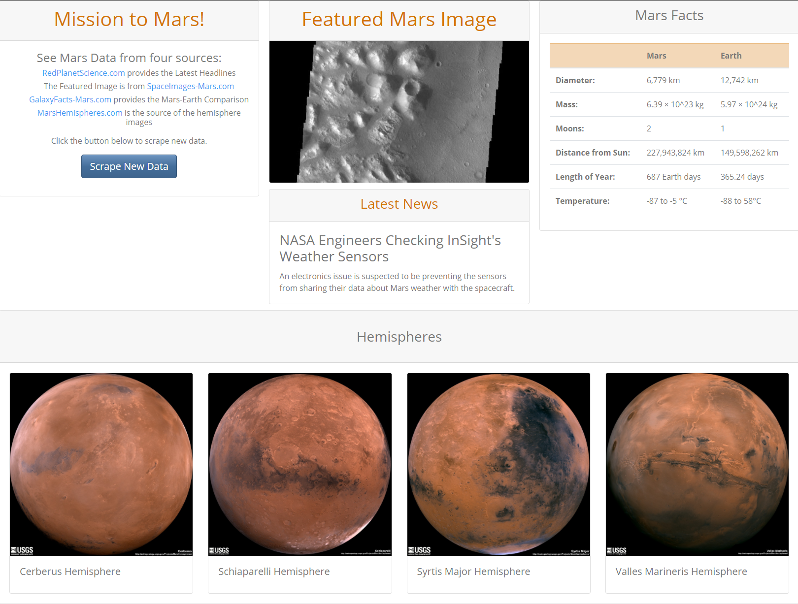

# Scraping Mars Data
This project uses a Flask app to scrape data from four sources: 

* [RedPlanetScience.com](https://redplanetscience.com/) provides the Latest Headlines

* The Featured Image is from [SpaceImages-Mars.com](https://spaceimages-mars.com/)

* [GalaxyFacts-Mars.com](https://galaxyfacts-mars.com/) provides the Mars-Earth Comparison

* [MarsHemispheres.com](https://marshemispheres.com/) is the source of the hemisphere images

The data is then used to populate an html template like the one below: 

## Files in the Repo

All files for the project are stored in the [Missions_to_Mars](/Missions_to_Mars/) folder. This folder contains: 

1. The [mission_to_mars](/Missions_to_Mars/mission_to_mars.ipynb) Jupyter Notebook

2. The [Flask app](/Missions_to_Mars/app.py)

3. The [scrape_mars](/Missions_to_Mars/scrape_mars.py) python file that contains the scrape functions

4. The [html template](/Missions_to_Mars/templates/index.html)

## Status
_finished_

## Inspiration
This project was assigned as part of the UTSA Data Analytics Bootcamp.